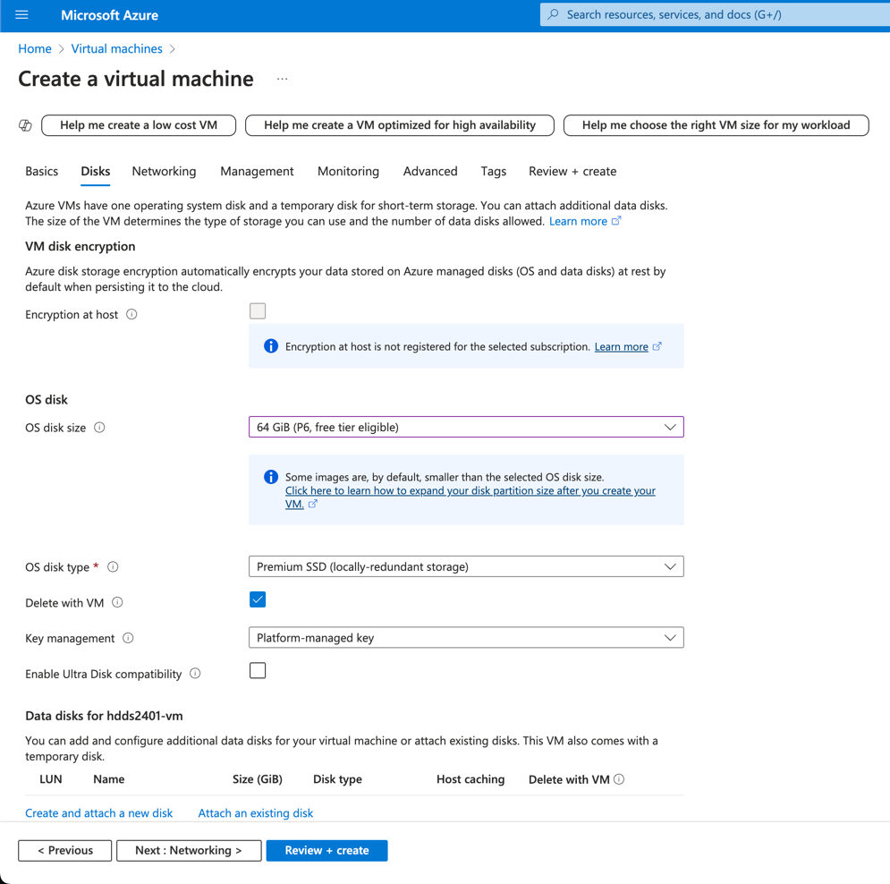

# Student Management System

# Description

This is a simple student management system that allows you to add, delete, update and view students.
\
It is a web application that uses MySQL to store the student data.

# Live Demo

The application is deployed on Azure and can be accessed at the following URL:

- <https://HDDS2401-smy.12345.ing>

When login credentials are requested, use the following (case-sensitive):

- Username: HDDS2401
- Password: 2024

# Develop Approach

The software is developed using the following approach:

1. **Programming Language**: Python
    - **Reason**: Python is a versatile and widely-used language, especially suitable for web development and data
      manipulation. It has a rich ecosystem of libraries and frameworks that facilitate rapid development.

2. **Framework**: Sanic
    - **Reason**: Sanic is an asynchronous web framework for Python that is designed for quick HTTP responses. It is
      suitable for building high-performance web applications.

3. **Template Engine**: Jinja2
    - **Reason**: Jinja2 is a fast, expressive, and extensible templating engine for Python. It allows for the
      separation of HTML presentation from Python code, making the codebase cleaner and more maintainable.

4. **ORM**: SQLAlchemy with aiomysql
    - **Reason**: SQLAlchemy is a powerful and flexible ORM that supports asynchronous operations with aiomysql. This
      combination allows for efficient database interactions in an asynchronous environment.

5. **Cloud Service Model**: Infrastructure as a Service (IaaS)
    - **Reason**: IaaS provides the most control over the infrastructure, allowing for custom configurations and
      optimizations. It is suitable for applications that require specific setups or have high performance and
      scalability needs.

6. **Database**: MySQL
    - **Reason**: MySQL is a reliable and widely-used relational database management system. It is well-supported and
      integrates seamlessly with SQLAlchemy and aiomysql for asynchronous operations.

This approach ensures a robust, scalable, and maintainable web application that leverages modern asynchronous
programming techniques for high performance.

# Features

The student management system provides the following features:

- [X] Add a new student
- [X] Delete an existing student
- [X] Update student information
- [X] View all students

# Deployment

## Prerequisites

- Ubuntu 20.04 LTS (or newer)
- Python 3.9+
- MySQL (In this case, Azure Database for MySQL is used)

To install and run the student management system, follow these steps:

## Azure Setup

1. **Create an Azure Database for MySQL server**:
    - Go to the Azure portal
      and [create a new Azure Database for MySQL server](https://portal.azure.com/#create/Microsoft.MySQLServer).
    - Select `Quick Create`
    - 
    - Note down the `username`, `password` for later use.
    - 
    - Wait for deployment complete.
    - Once deployed, note down the `serve name` for later use.
    - 
    - Go to `Settings` -> `Server parameters`, set `require_secure_transport` to `OFF`. When done, press `Save`.
    - 
    - Go to `Settings` -> `Databases`, add a new database named `smy_db`.
    - 
    - Go to `Settings` -> `Networking`, allow internet access from all networks (`+ Add 0.0.0.0 - 255.255.255.255`). When done, click `Save`.
    - 

2. **Create an Azure Virtual Machine**:
    - Go to the Azure portal
      and [create a new Azure Virtual Machine](https://portal.azure.com/#create/Microsoft.VirtualMachine-ARM).
    - Choose `Ubuntu 20.04 LTS` as the operating system and Size as `Standard_B1s`.
    - 
    - On networking, open port `80` for HTTP traffic and port `443` for HTTPS traffic. (Default `22` SSH port is already
      opened)
    - Enter your own `username` and `password` for the virtual machine.
    - 
    - Choose disk size `64GB`.
    - 
    - Once deployed, note down the `Public IP address` of the virtual machine.
    - 

3. **Connect to the Virtual Machine**:
    - Use SSH to connect to the virtual machine using the public IP address.
    - Use the following command:
      ```bash
      ssh username@public-ip-address
      ```
    - Enter the password when prompted.
    - Update the package list and upgrade the installed packages:
      ```bash
      sudo apt update && sudo apt upgrade -y
      ```
    - Install the necessary packages:
      ```bash
        sudo apt install git python3 python3-venv python3-pip -y
        ```

4. **Clone the Repository**:
    - Follow the project setup instructions below.

## Project Setup

Inside the virtual machine, follow these steps:

Clone this repository:

```bash
git clone https://github.com/01101sam/HDDS2401_Student_Managment_System student-management-system
cd student-management-system
```

Create a virtual environment:

```bash
python3 -m venv venv
source venv/bin/activate
```

Install the dependencies:

```bash
pip install -r requirements.txt
```

Update the database connection details in the `.env` file:

```bash
cp .env.example .env
nano .env
# or vim .env
```

Replace the placeholders with your Azure Database for MySQL connection details.

Run the application:

```bash
sudo python app.py
```

The application should now be running on the virtual machine. You can access it by navigating to the public IP address
